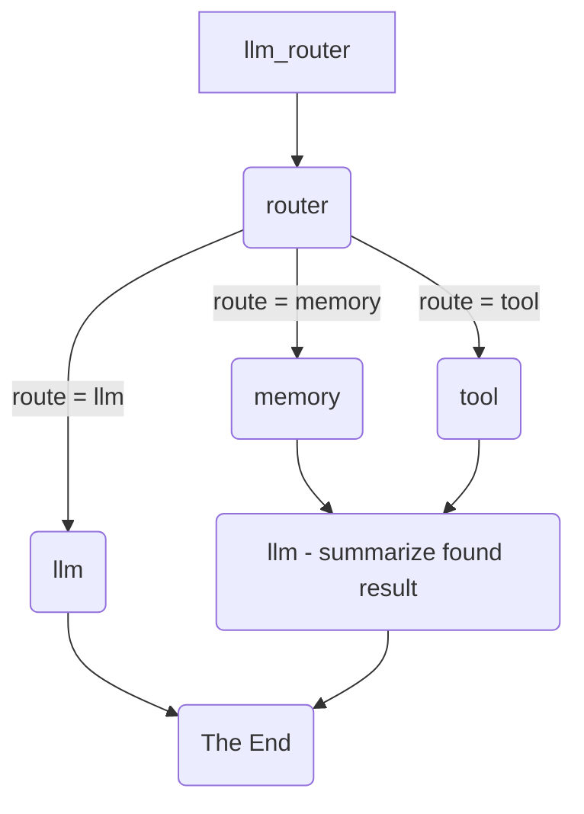

```mermaid
graph TD    
    llm_router --> router(router)

    router -- "route = memory" --> memory(memory)
    router -- "route = tool" --> tool(tool)
    router -- "route = llm" --> llm_direct(llm)

    llm_direct --> end_direct(end)

    memory --> llm_summarize(llm)
    tool --> llm_summarize(llm - summarize found result)

    llm_summarize --> end_direct(The End)
```