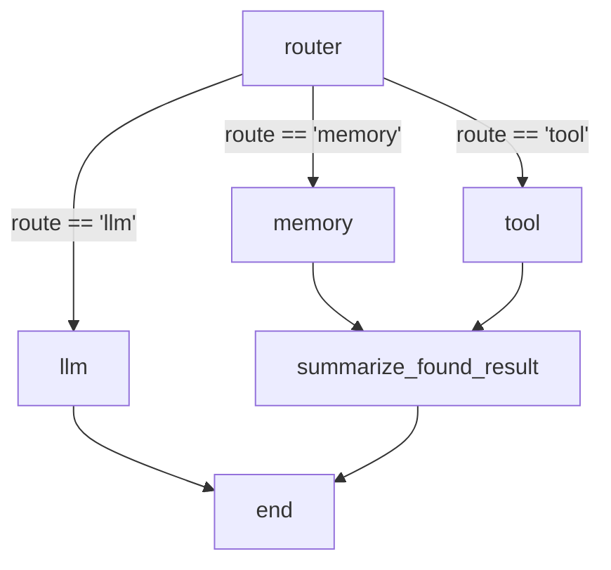

```mermaid
graph TD
    Router["router"]
    Memory["memory"]
    Tool["tool"]
    LLM["llm"]
    Summarize["summarize_found_result"]
    End["end"]

    Router -->|route == 'memory'| Memory
    Router -->|route == 'tool'| Tool
    Router -->|route == 'llm'| LLM

    Memory --> Summarize
    Tool --> Summarize

    LLM --> End
    Summarize --> End
```